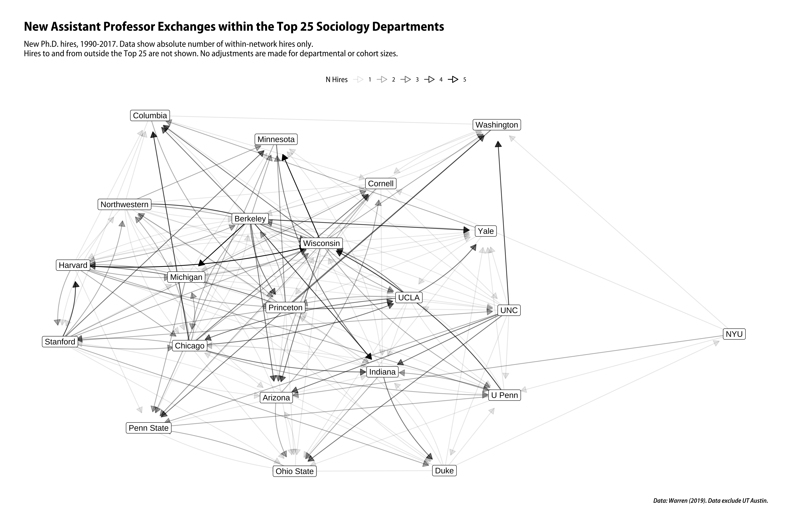

<!-- README.md is generated from README.Rmd. Please edit that file -->


# kjhnet

<!-- badges: start -->
[](https://travis-ci.org/kjhealy/kjhnet)
<!-- badges: end -->

Some network data, for teaching purposes. 

- Iliad data are from Gabriel Rossman (2017) "[Glory and Gore](https://journals.sagepub.com/doi/full/10.1177/1536504217732052)", *Contexts* 16(3):42--47. Original data files available at <https://osf.io/jasf4/>.

- Sociology Top 25 Jobs data are from John Robert Warren, (2019) "How Much Do You Have to Publish to Get a Job in a Top Sociology Department? Or to Get Tenure? Trends Over a Generation", *Sociological Science* February 27, 2019 doi://10.15195/v6.a7. Original data files available at <https://www.rob-warren.com/pub_trends.html>. 


## Installation

`kjhnet` is a data package. 

### Install direct from GitHub

You can install the beta version of kjhnet from [GitHub](https://github.com/kjhealy/kjhnet) with:

``` r
devtools::install_github("kjhealy/kjhnet")
```

### Installation using `drat`

While using `install_github()` works just fine, it would be nicer to be able to just type `install.packages("kjhnet")` or `update.packages("kjhnet")` in the ordinary way. We can do this using Dirk Eddelbuettel's [drat](http://eddelbuettel.github.io/drat/DratForPackageUsers.html) package. Drat provides a convenient way to make R aware of package repositories other than CRAN.

First, install `drat`:


```r
if (!require("drat")) {
    install.packages("drat")
    library("drat")
}
```

Then use `drat` to tell R about the repository where `kjhnet` is hosted:


```r
drat::addRepo("kjhealy")
```

You can now install `kjhnet`:


```r
install.packages("kjhnet")
```

To ensure that the `kjhnet` repository is always available, you can add the following line to your `.Rprofile` or `.Rprofile.site` file:


```r
drat::addRepo("kjhealy")
```

With that in place you'll be able to do `install.packages("kjhnet")` or `update.packages("kjhnet")` and have everything work as you'd expect. 

Note that the drat repository only contains data packages that are not on CRAN, so you will never be in danger of grabbing the wrong version of any other package.


## Loading the data

The package works best with the [ggraph](https://github.com/thomasp85/ggraph), [tidygraph](https://github.com/thomasp85/tidygraph), and broader [tidyverse](http://tidyverse.org/) libraries.


```r
library(tidyverse)
library(ggraph)
library(tidygraph)
#> 
#> Attaching package: 'tidygraph'
#> The following object is masked from 'package:stats':
#> 
#>     filter
#> The following object is masked from 'package:testthat':
#> 
#>     matches
```

Load the data:


```r
library(kjhnet)
```

## Example

Some off-label use of Rob Warren's Top 25 Sociology Jobs data.


```r
library(ggraph)
library(tidygraph)

set_graph_style(family = "Myriad Pro SemiCondensed")

clean_dept_names <- function(x){
    x <- stringr::str_replace(x, "California-", "")
    x <- stringr::str_replace(x, "SUNY-", "")
    x <- stringr::str_replace(x, "SUNY-", "")
    x <- stringr::str_replace(x, "Illinois-Chicago", "UIC")
    x <- stringr::str_replace(x, "U of Illinois", "UIUC")
    x <- stringr::str_replace(x, "U of Pennsylvania", "U Penn")
    x <- stringr::str_replace(x, "San Francisco", "UCSF")
    x <- stringr::str_replace(x, "North Carolina", "UNC")
    x <- stringr::str_replace(x, "N.C. State", "NC State")
    x
}

(p1 <- socjobs %>% 
  filter(top25phd == "Yes", phd_dept != "Texas", job_dept != "Texas") %>%
  select(phd_dept, job_dept) %>%
  mutate(phd_dept = clean_dept_names(phd_dept),
         job_dept = clean_dept_names(job_dept)) %>%
  group_by(phd_dept, job_dept) %>%
  tally() %>% 
  select(from = phd_dept, to = job_dept, weight = n) %>%
  mutate(scale_weight = scale(weight, center = FALSE)) %>% 
  filter(weight > 0) %>% 
  as_tbl_graph() %>%
  mutate(centrality = centrality_eigen(weights = weight)) %>%
  ggraph(layout = "graphopt") + 
  geom_edge_fan(aes(alpha = weight),
                arrow = arrow(length = unit(3, 'mm'), type = "closed"), 
                start_cap = circle(2, 'mm'),
                end_cap = circle(8, 'mm')) + 
  geom_node_label(aes(label = name)) + 
  scale_edge_alpha_continuous(name = "N Hires") + 
  labs(title = "New Assistant Professor Exchanges within the Top 25 Sociology Departments", 
       subtitle = "New Ph.D. hires, 1990-2017. Data show absolute number of within-network hires only.\nHires to and from outside the Top 25 are not shown. No adjustments are made for departmental or cohort sizes.", 
       caption = "Data: Warren (2019). Data exclude UT Austin.") + 
  theme_graph(base_family = "Myriad Pro SemiCondensed") + 
    theme(legend.position = "top") 
)
  
ggsave(here("man/figures/README-example-1.png"), p1, height = 10, width = 15, dpi = 300)

```



